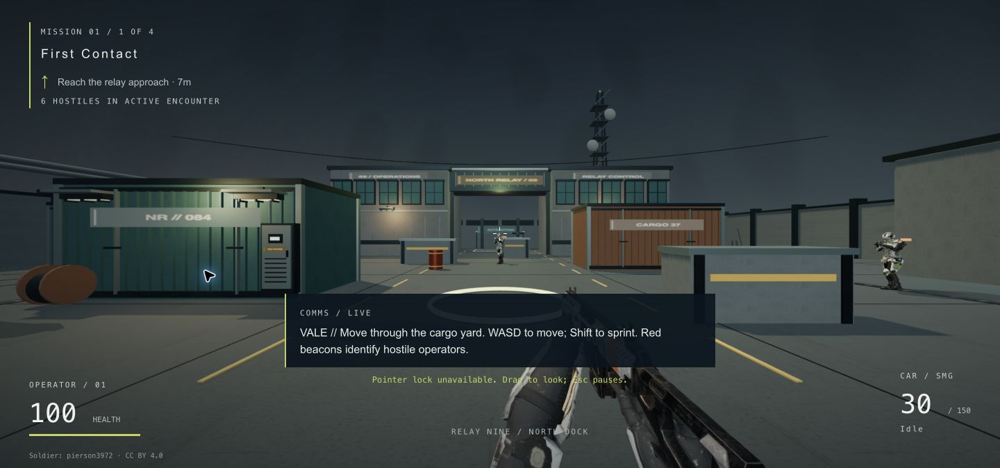
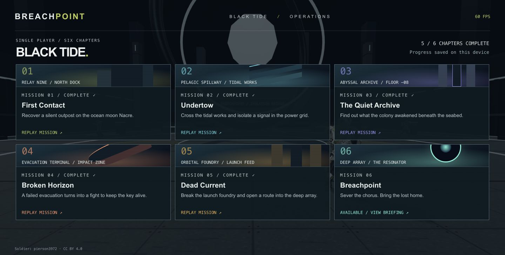
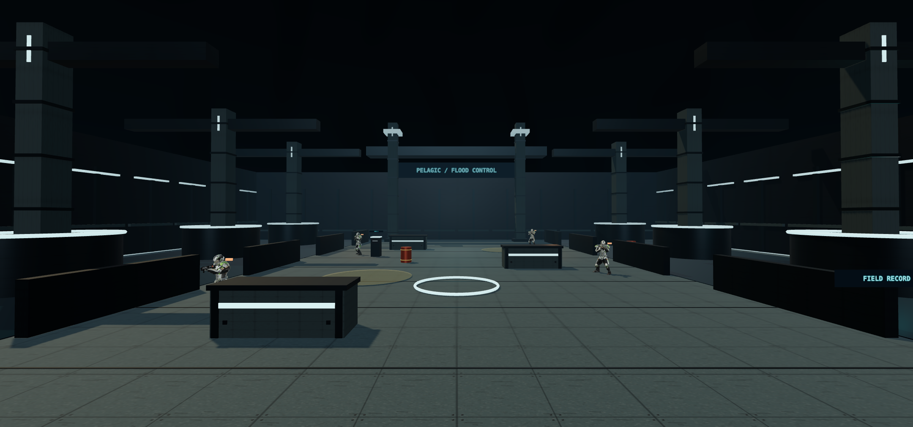
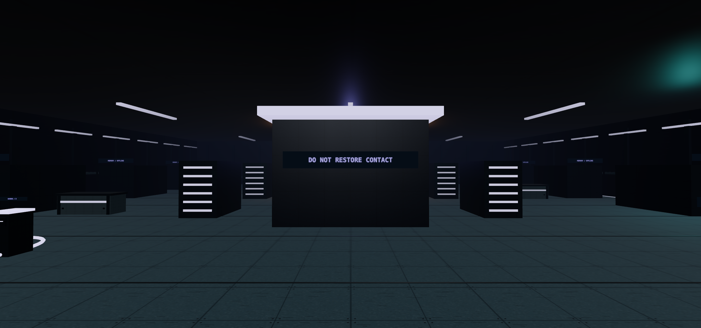
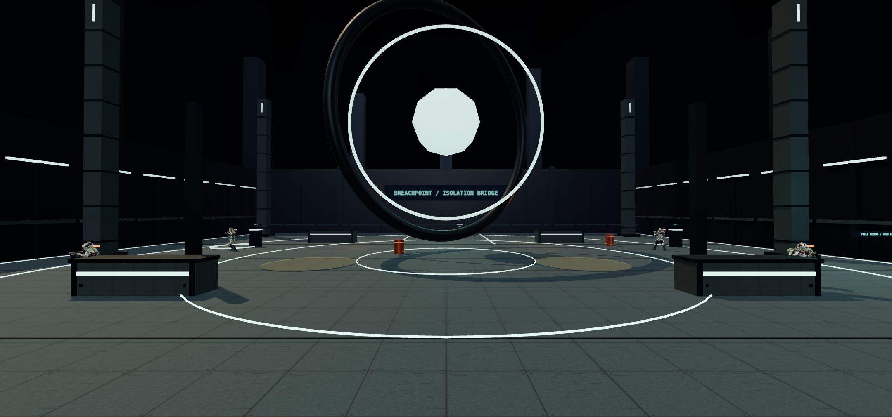

<div align="center">

# BREACHPOINT
### BLACK TIDE

**A six-chapter science-fiction FPS campaign, built for the desktop browser.**

React 19 · TypeScript · Three.js · Vinext / Vite

[Campaign](#the-campaign) · [Screenshots](#screenshots) · [Quick start](#quick-start) · [Architecture](#architecture) · [Validation](#validation) · [Credits](#asset-credits)

</div>



## Overview

A distress signal breaks the silence on the ocean moon Nacre. As **Kestrel**, a Breachpoint response operator, you arrive to recover a coastal relay station—and follow the transmission into a conflict that reaches far beneath the colony.

**Black Tide** expands a single-map FPS into a connected six-mission campaign. The experience combines close-quarters combat, industrial environments, short radio exchanges, optional field records, and objectives that evolve during play. Chapter progression is saved locally, and completed missions remain available for replay.

The project demonstrates browser-based 3D game development across rendering, skeletal animation, enemy navigation, combat simulation, campaign state, and React interface design. It is a playable single-player project with two weapons and six compact environments; desktop keyboard and mouse are required.

## Gameplay highlights

- **Six connected missions.** Distinct layouts, lighting, landmarks, and encounter sequences connect the relay station, tidal works, archive, evacuation terminal, foundry, and deep array.
- **Structured objectives.** Reach locations, operate terminals, secure areas, and defend uplinks. Reinforcement waves, pulsing hazards, blackouts, and scripted environmental events shape each chapter.
- **Two integrated weapons.** The CAR SMG and Desert Eagle support aiming, recoil, independent magazines, reserve ammunition, timed reloads, and weapon switching.
- **Animated operators.** Player and enemies share the Soldier asset, with blended Idle/Walk/Run animation and weapon poses that preserve hand contact.
- **Reactive enemy behavior.** Operators patrol, investigate gunfire, pursue targets, check line of sight, and seek nearby cover when hit.
- **Persistent chapter progression.** Every mission appears in the campaign menu. Completing a chapter unlocks the next; replays preserve previous completion records.

## Screenshots

All images below were captured from the running application. Mission environment images are rendered by the app’s existing validation camera; they are not concept art or offline promotional renders.

### Campaign selection



### Two sides of Nacre

| Pelagic spillway · Mission 02 | The Quiet Archive · Mission 03 |
| :---: | :---: |
|  |  |

### The deep array · Mission 06



## The campaign

| Chapter | Mission | Environment | Gameplay focus |
| :---: | --- | --- | --- |
| 01 | **First Contact** | Relay Nine / North Dock | Secure the station, recover a distress buffer, and reach extraction |
| 02 | **Undertow** | Pelagic Spillway | Cross the tidal works, isolate pumps, and defend a tracing uplink |
| 03 | **The Quiet Archive** | Abyssal Archive | Explore abandoned research, recover records, and survive quarantine |
| 04 | **Broken Horizon** | Evacuation Terminal | Signal a carrier, weather an attack, and find an escape route |
| 05 | **Dead Current** | Orbital Foundry | Assault power buses and hold the transmitter shutdown console |
| 06 | **Breachpoint** | Deep Array | Release anchor locks and defend the final isolation process |

**Mission flow:** briefing → deployment → evolving objectives → mission complete → saved unlock → next chapter or campaign selection.

The active objective has a world marker, direction indicator, and distance readout. Hold **E** near a terminal or field record to interact. Defense timers advance inside the marked area and require the active reinforcements to be defeated. Console milestones replenish ammunition reserves.

Saves preserve completed chapters, the highest unlocked mission, the last-played mission, and campaign completion. They do **not** preserve an encounter in progress: refreshing or restarting returns you to chapter selection, and a failed mission restarts from insertion.

## Quick start

### Requirements

- **Node.js 22.13 or newer**; Node 22.x is the documented deployment target.
- **npm**, using the committed `package-lock.json`.
- A desktop browser with WebGL support, a keyboard, and a mouse.

From the repository root:

```bash
npm ci
npm run dev
```

Open **http://localhost:3000**, select an available mission, read the briefing, and deploy.

The required models are already stored in `public/models/`. Normal setup does not require asset conversion, application environment variables, an account, or a database.

### Controls

| Action | Input |
| --- | --- |
| Move | **W A S D** or **arrow keys** |
| Look | **Mouse** |
| Sprint | **Shift** |
| Jump | **Space** |
| Fire | **Left mouse button** |
| Aim | **Right mouse button** |
| Reload | **R** |
| Switch weapon | **1 / 2** |
| Operate terminal / recover field record | **Hold E** |
| Toggle first-person / operator view | **V** |
| Mute audio | **M** |
| Pause | **Esc** |

Losing window focus pauses combat. When pointer lock is unavailable, drag with the mouse to look around.

## Architecture

React owns the application lifecycle, campaign selection, briefings, and HUD. Mutable Three.js state and per-frame simulation remain in the game classes rather than React state.

| Layer | Main files | Responsibility |
| --- | --- | --- |
| Application interface | [`app/page.tsx`](app/page.tsx), [`app/globals.css`](app/globals.css) | Game lifecycle, mission cards, briefings, HUD, completion screens, and optional validation controls |
| Game orchestration | [`Game.ts`](lib/game/Game.ts) | Renderer, camera, loading, input, combat, objective integration, reset, and disposal |
| Campaign content | [`Campaign.ts`](lib/game/Campaign.ts) | Mission metadata, world selection, objectives, radio messages, spawns, waves, hazards, and field records |
| Mission simulation | [`MissionDirector.ts`](lib/game/MissionDirector.ts) | Pure objective transitions and completion conditions, independent of the DOM and renderer |
| Progression and persistence | [`CampaignProgress.ts`](lib/game/CampaignProgress.ts) | Unlock rules, save normalization, replay behavior, and the replaceable `ProgressStore` interface |
| World construction | [`Environment.ts`](lib/game/Environment.ts), [`CampaignWorld.ts`](lib/game/CampaignWorld.ts), [`CampaignSurfaces.ts`](lib/game/CampaignSurfaces.ts) | Original relay, five additional layouts, collision geometry, procedural materials, landmarks, and events |
| Player and weapons | [`CharacterController.ts`](lib/game/CharacterController.ts), [`FirstPersonArms.ts`](lib/game/FirstPersonArms.ts), [`Weapon.ts`](lib/game/Weapon.ts) | Movement, grounding, animation blending, skinned arms, weapon sockets, ammunition, poses, and audio |
| Enemy simulation | [`Enemies.ts`](lib/game/Enemies.ts), [`EnemyWeaponPose.ts`](lib/game/EnemyWeaponPose.ts) | Navigation, perception, encounter waves, combat, cover reactions, and skeletal rifle grip |
| Combat feedback | [`Effects.ts`](lib/game/Effects.ts) | Pooled tracers, sparks, smoke, and shell ejection |

### Engineering decisions

**Campaign data is shared across systems.** Mission definitions drive the menu, level selection, objectives, and encounter schedule. The mission director evaluates reach, interaction, clear-area, and defense conditions without depending on rendering or persistence.

**Persistence has an adapter boundary.** `CampaignProgress` accesses a `ProgressStore`; the browser implementation uses the versioned key `breachpoint.black-tide.v1`. Unlocks are derived from contiguous completion records, and saving merges existing completions to prevent an earlier replay from reducing progress. If storage is unavailable, the session retains progress and displays a warning. A future server-backed store can replace the adapter without coupling the UI to database calls.

**Character identity is consistent.** First-person arms reuse the Soldier’s skinned geometry, materials, and rig. Weapons attach to its hand socket. Enemy rifle poses use two-bone inverse kinematics to keep the support hand on the weapon during locomotion and aiming. The source model supplies one ready/idle clip; Walk and Run are generated skeletal animations, not supplied motion capture.

**Rendering costs are bounded.** The renderer caps pixel ratio at 1.5 and the simulation timestep at 40 ms. Environment detail uses instancing, enemy skeletons share reusable geometry and textures, combat effects are pooled, and line-of-sight checks are cached. Weapon textures are uploaded and materials compiled before deployment. These are implementation choices, not a cross-device performance guarantee.

## Development commands

| Command | Purpose |
| --- | --- |
| `npm run dev` | Start the Vinext development server |
| `npm run typecheck` | Run strict TypeScript checks |
| `npm run lint` | Lint authored application, game, script, and test code |
| `npm test` | Run controller, weapon, enemy, and campaign tests |
| `npm run format` | Format with Oxfmt |
| `npm run build` | Build the default Cloudflare/Sites target |
| `npm run start -- --port 4173` | Preview the default production build through Wrangler |
| `npm run build:vercel` | Produce the static export in `dist/client` |

This project uses **Vinext**, which provides Next-style imports on Vite. It is not a conventional `next build` application. Both production targets write to `dist`; rebuild the intended target before previewing or packaging it.

## Validation

### Automated checks

```bash
npm run typecheck
npm run lint
npm test
npm run build
```

The Node suites cover movement, animation blending, collision, weapon timing, ammunition, enemy behavior, sequential unlocks, save recovery, replay preservation, objective gates, and reinforcement resets. Campaign tests also check that objectives, field records, and enemy spawns are reachable against each map’s collision geometry.

The current Node harness writes bundled fixtures to `/private/tmp`. Adapt that path when running on platforms where it is unavailable.

### Browser checks with real models

Open **http://localhost:3000/?validate=1** to expose the validation panel:

| Action | Coverage |
| --- | --- |
| **Run integration validation** | From Mission 01: actual GLB loading, skinning, animation, controls, weapon sockets, both-hand contact, combat, death, and reset; resets the current operation |
| **Inspect enemy grip** | Close-up front and side renders of the animated Soldier carrying the CAR |
| **Run campaign validation** | Loads all six worlds, exercises objective transitions and completion callbacks, reopens an isolated save, checks replay preservation, and renders mission inspection views |

The campaign harness simulates combat outcomes and uses an isolated temporary save; it does not unlock the player’s campaign.

**Recorded campaign validation:** 107 real-model integration checks and 67 campaign checks passed, alongside TypeScript, lint, Node tests, and both production builds. All six environments were visually inspected. The inspected production preview loaded the model assets without captured console errors or GLTF warnings. These results describe the campaign implementation validation, not a guarantee for later changes or other devices. A complete manual six-mission combat-balance playthrough remains outstanding.

## Deployment

### Vercel static export

The committed [`vercel.json`](vercel.json) configures:

| Setting | Value |
| --- | --- |
| Framework preset | **Other** |
| Install command | `npm ci` |
| Build command | `npm run build:vercel` |
| Output directory | `dist/client` |
| Node runtime | **22.x** |

No application environment variables or Cloudflare bindings are required for the static game. Keep all three GLBs in the deployed repository.

To preview the export locally:

```bash
npm run build:vercel
python3 -m http.server 4174 --directory dist/client
```

Open **http://localhost:4174**. The preview command requires Python 3; another static HTTP server can serve the same directory. `npm run start` previews the default Cloudflare build, not this static export.

The existing Sites identity and build configuration remain available for the default target. A successful local build does not publish a deployment.

## Scope and current limitations

- **Desktop, single player.** No multiplayer, touch controls, gamepad support, accounts, or backend storage.
- **Chapter-level saves.** No mid-mission checkpoints or cloud synchronization; browser storage is local to the site and device.
- **Compact collision model.** Upright box collision, flat ground, and box-top landing; no general rigid-body physics, slopes, or ragdolls.
- **Procedural animation and audio.** Locomotion, weapon motion, and synthesized sound are generated. Reloads move the weapon rig rather than animating a full magazine exchange.
- **Limited destruction.** Explosive barrels and scripted visual events; no general destructible-world system.
- **Validation boundaries.** Automated campaign checks do not replace human balance testing or performance profiling across desktop GPUs. The optional `read_operation` integration is feature-detected and read-only; execution in a supported WebMCP host has not been verified.

## Asset credits

The environment, campaign, interface, and gameplay integration are project work. Character and weapon model authorship belongs to the creators below.

| Asset | Creator | License |
| --- | --- | --- |
| [Soldier Glb 3](https://sketchfab.com/3d-models/soldier-glb-3-0edc19e9d55040f6b1cbbbc8f98bb6b9) | **pierson3972** | CC BY 4.0 |
| [CAR SMG — Titanfall 2 fan art](https://sketchfab.com/3d-models/car-smg-from-titanfall-2-fan-art-73ea7ee62e4545aea93ca1483b50b5fe) | **No.cccccc** | CC BY 4.0 |
| [Desert Eagle](https://sketchfab.com/3d-models/desert-eagle-cabde59f5cf24effaf80536e35d04e95) | **ELIZION** | CC BY 4.0 |

See **[CREDITS.md](CREDITS.md)** for original source links, [CC BY 4.0 license terms](https://creativecommons.org/licenses/by/4.0/), and texture, material, rig, and runtime modification disclosures. The CAR is credited Titanfall 2 fan art, not an original Breachpoint weapon design. Screenshots include these credited assets.

The repository does not currently declare a license for the application source code. The third-party model licenses do not establish a license for the rest of the project.

<details>
<summary><strong>Optional: reproduce model preparation</strong></summary>

The browser-ready files in `public/models/` are sufficient for normal development and deployment. Reprocessing requires the original source GLBs and `sharp`, which is not a direct project dependency.

```bash
node scripts/prepare-soldier.mjs path/to/soldier_glb_3.glb
node scripts/prepare-weapons.mjs CAR-source.glb DesertEagle-source.glb
```

The preparation scripts adapt embedded textures and materials for browser use. Preserve model filenames, source attribution, and modification disclosures when changing assets.

</details>
